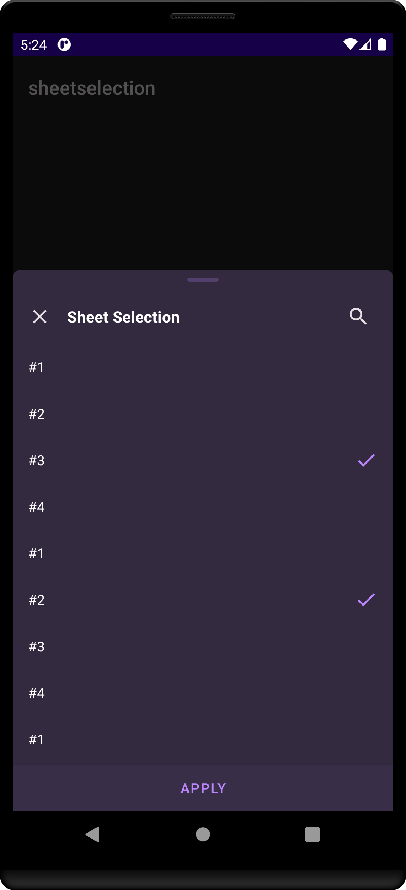
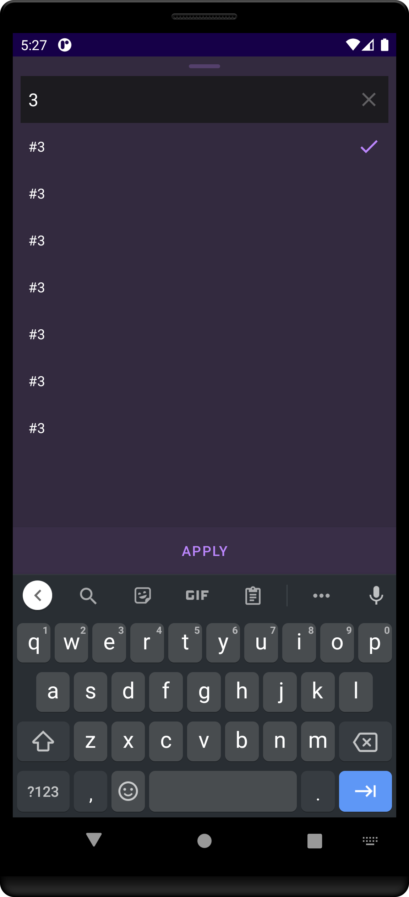

# Sheet Selection
[](https://jitpack.io/#khoben/sheetselection)
[](https://raw.githubusercontent.com/minibugdev/DrawableBadge/master/LICENSE)

## Based on [minibugdev/SheetSelection](https://github.com/minibugdev/SheetSelection/tree/d6958f9a4ebe95eca539c9edc098d648ecd0d177) with some improvements:
1. Multi-selection
2. Retained selection callback
3. Survive on rotation
4. and more little changes...

### [Sample app (apk)](https://github.com/khoben/sheetselection/releases/latest/download/sample.apk)

## How to use
```kotlin
class MainActivity (or Fragment) : SheetSelectionListener {
    showSheetSelection("MY_TAG") {
        title("Sheet Selection")
        items(List(25) { 
            SheetSelectionItem("$it", "#$it") 
        })
        enableDraggableIndicator(true)
        enableMultiSelection(true)
        enableSearch(true)
        enableCloseButton(true)
        multiSelectionButtonText("Select")
        searchNotFoundText("Empty")
    }

    override fun onSheetItemsSelected(event: SheetSelectionEvent) {
        event.doIfMatches("MY_TAG") { selected ->
            Toast.makeText(
                this,
                "Selected: ${selected.joinToString { it.value }}",
                Toast.LENGTH_LONG
            ).show()
        }
    }
}
```

## Screenshots
<table>
    <td>
        <p align="center"></p>
    </td>
     <td>
        <p align="center"></p>
    </td>
</table>

## Installation
Add it in your **root** `build.gradle` at the end of repositories:
``` groovy
repositories {
    ..
    maven { url 'https://jitpack.io' }
}
```
Add the dependency
``` groovy
dependencies {
    implementation 'com.github.khoben:sheetselection:3.0.1'
}
```